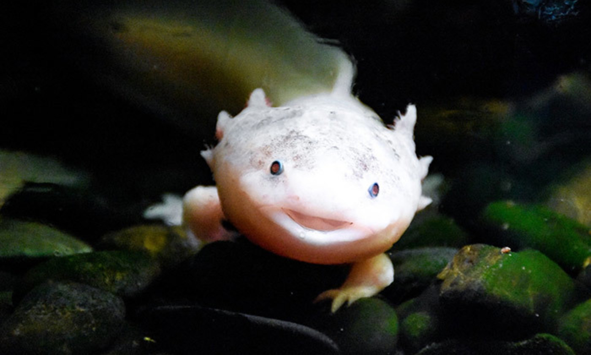

# Axolotl

<p align="center">

<br>
<small>(The curious Axolotl species of salamander. Public domain photo)</small>
</p>

:wave: Axolotl is an easy-to-use, lightweight, small online conference for interviewing or pair programming.

status: **mvp-dev**, this project is still in the minimum usable development stage.

**IMPORTANT** before you start, please disable any WebRTC-Protection or Fake-Device extensions.

## Usage

0. `sudo docker pull golang:alpine && sudo docker pull frolvlad/alpine-gcc:latest`

1. `mkdir -p axolotol/{code-data/temp,hello-data} && && cd axolotol`

2. `nano code-data/config.json`

   ```json
   {
     "clients": {
       "client": "auth-key"
     },
     "temp": "[这里要放 axolotol 文件夹的绝对路径]/code-data/temp/",
     "limit": false
   }
   ```

3. `nano hello-data/config.yaml`

   ```yaml
   github:
     clientid: 321d**********97dd
     clientsecret: 85a76*******************8f760
   code:
     endpoint: http://coderunner:3000
     authorization: Y2xpZW50OmF1dGgta2V5 #base64(client:auth-key)
   site:
     name: Axolotol
     desc: Keep Coding
   ```

4. docker-compose.yaml

   ```yaml
   version: "3.3"

   services:
     axolotl:
       image: ghcr.io/naiba/axolotl:latest
       ports:
         - "8080:80"
       restart: always
       volumes:
         - ./hello-data:/axolotl/data/
     coderunner:
       image: ghcr.io/naiba/code-runner:latest
       restart: always
       volumes:
         - /var/run/docker.sock:/var/run/docker.sock
         - ./code-data:/coderunner/data/
   ```

5. `docker-compose up -d` and visit `ip:8080`
